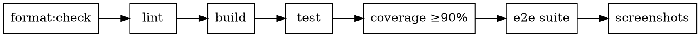

# Cut Release

Step-by-step process for cutting a versioned release of the Air Traffic Control monorepo. Produces a PR to `main` with updated versions, changelogs, screenshots, and documentation.

## When to Use

- A set of features is ready to ship as a named version
- The board or CTO requests a release cut
- Unreleased changelog sections have accumulated enough changes

## Pre-Flight Checks

Before starting, verify:

```bash
git checkout main && git pull origin main
git status  # must be clean
pnpm install
pnpm run build  # must compile cleanly
pnpm run test   # all tests must pass
```

If any check fails, fix the issue on `main` before proceeding. Do not cut a release from a broken baseline.

## Process

### Step 1 — Determine Version Number

Review the `## Unreleased` sections across all package changelogs:

```bash
for f in packages/*/CHANGELOG.md; do echo "=== $f ==="; head -30 "$f"; echo; done
```

Apply semver rules based on the aggregate changes:

| Change Type | Bump | Examples |
|---|---|---|
| Breaking changes to exported APIs | **Major** (`X.0.0`) | Removed exports, changed type signatures, renamed public functions |
| New features, new exports, backward-compatible additions | **Minor** (`0.X.0`) | New functions, new optional fields, new packages |
| Bug fixes, internal refactors, documentation-only | **Patch** (`0.0.X`) | Fixed edge cases, improved error messages, test additions |

Use the **highest applicable bump** across all packages as the release version. All packages in the monorepo share one version number per release.

### Step 2 — Create Release Branch

```bash
git checkout -b release/vX.Y.Z
```

### Step 3 — Update Package Versions

Update `version` in every `packages/*/package.json` and the root `package.json`:

```bash
NEW_VERSION="X.Y.Z"
# Update root
jq --arg v "$NEW_VERSION" '.version = $v' package.json > tmp.json && mv tmp.json package.json
# Update each package
for pkg in packages/*/package.json; do
  jq --arg v "$NEW_VERSION" '.version = $v' "$pkg" > tmp.json && mv tmp.json "$pkg"
done
```

Verify the changes look correct:

```bash
git diff --stat
grep -r '"version"' packages/*/package.json package.json | head -20
```

### Step 4 — Finalize Changelogs

For each package with content under `## Unreleased`, replace the heading with a versioned, dated section. Preserve the empty `## Unreleased` heading for future changes.

**Before:**
```markdown
## Unreleased

### Added
- Feature X
```

**After:**
```markdown
## Unreleased

## [X.Y.Z] - YYYY-MM-DD

### Added
- Feature X
```

Repeat for every `packages/*/CHANGELOG.md` that has unreleased entries. Packages with an empty `## Unreleased` section need no changes.

### Step 5 — Quality Gates

Run the full contributing checklist. Every gate must pass before proceeding.



Run each gate in order. Stop on first failure.

```bash
pnpm run format:check
pnpm run lint
pnpm run build
pnpm run test
pnpm run test -- --coverage  # verify 90%+ on all files

# E2E (requires Chromium installed)
pnpm --filter @airtrafficcontrol/e2e exec playwright install chromium
pnpm --filter @airtrafficcontrol/web build
pnpm --filter @airtrafficcontrol/e2e test
```

### Step 6 — Regenerate Screenshots

Always regenerate screenshots during a release cut, even if no UI changes are obvious. This ensures the README images match the current version.

```bash
pnpm --filter @airtrafficcontrol/e2e test:screenshots
```

This runs the screenshot Playwright suite and copies the output to `docs/assets/screenshots/`. Verify the new screenshots look correct by viewing the generated PNGs:

- `docs/assets/screenshots/dashboard.png`
- `docs/assets/screenshots/craft-detail.png`

### Step 7 — Documentation Review

Review each documentation file for accuracy against the current codebase and changelog:

| File | Check |
|---|---|
| `README.md` | Package descriptions match current state, screenshots are current, getting started instructions work |
| `docs/specification.md` | Any new RULE-* identifiers are indexed in Appendix A, no stale rule references |
| `docs/overview.md` | Design brief still reflects the system accurately |
| `docs/config.md` | Configuration options match daemon implementation |
| `docs/rest_api.md` | API routes match daemon route definitions |
| `docs/contributing.md` | Checklist steps are current and commands work |
| `docs/agent/operating-manual.md` | Pilot guidance reflects current protocols |

Flag any discrepancies. Fix documentation issues in this release branch, or create follow-up issues for larger rewrites.

### Step 8 — Commit and Create PR

Stage all changes and create a single release commit:

```bash
git add -A
git commit -m "release: vX.Y.Z

- Updated all package versions to X.Y.Z
- Finalized changelogs with release date
- Regenerated README screenshots
- Verified documentation accuracy

Co-Authored-By: Paperclip <noreply@paperclip.ing>"
```

Push and create the PR:

```bash
git push -u origin release/vX.Y.Z

gh pr create \
  --title "release: vX.Y.Z" \
  --body "$(cat <<'EOF'
## Release vX.Y.Z

### Changes
[Summary of key changes from changelogs — group by package or theme]

### Quality Gates
- [ ] Format check passed
- [ ] Lint passed
- [ ] Build succeeded
- [ ] All unit tests passed
- [ ] Coverage ≥90% on all files
- [ ] E2E suite passed
- [ ] Screenshots regenerated
- [ ] Documentation reviewed

### Packages Updated
[List each package and its version bump rationale]
EOF
)"
```

### Step 9 — Post-Merge (after PR is approved and merged)

After the release PR lands on `main`:

```bash
git checkout main && git pull origin main
git tag -a vX.Y.Z -m "Release vX.Y.Z"
git push origin vX.Y.Z
```

## Failure Recovery

| Failure | Action |
|---|---|
| Quality gate fails | Fix on the release branch, re-run all gates from the beginning |
| Screenshots look wrong | Investigate the seed data or UI regression, fix before continuing |
| Documentation is stale | Update docs in the release branch; don't defer to a follow-up issue unless the fix is large |
| PR review requests changes | Address on the release branch, re-run quality gates, force-update screenshots |

## Common Mistakes

- **Forgetting to regenerate screenshots** — Even non-UI changes can affect the dashboard (new data types, changed status labels). Always regenerate.
- **Leaving `## Unreleased` empty without the heading** — Future changes need the heading present. Always preserve it.
- **Bumping versions inconsistently** — All packages share one version per release. Don't leave some at the old version.
- **Skipping documentation review** — Stale docs erode trust. The review is a required gate, not optional.
- **Creating the tag before the PR merges** — The tag must point to the merge commit on `main`, not the branch head.
